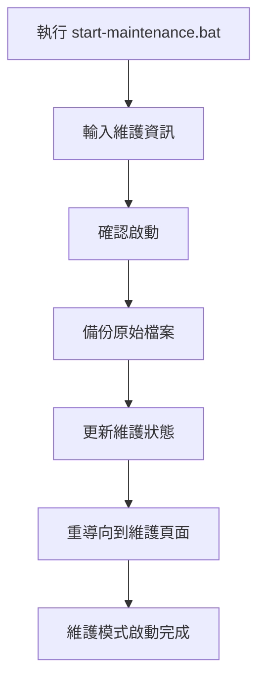
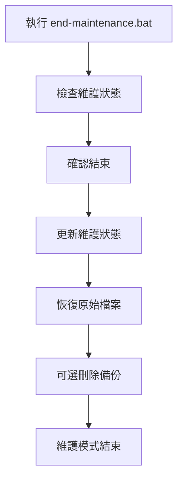

# 維護模式使用指南

## 📋 概述

無障礙廁所GO V2 提供了完整的維護模式功能，讓您可以輕鬆地將網站切換到維護狀態，並在維護完成後恢復正常運行。

## 🔧 維護模式功能

### ✅ 已實現的功能
- **自動重導向** - 維護期間自動將使用者導向維護頁面
- **美觀的維護頁面** - 專業的維護中頁面設計
- **維護狀態監控** - 自動檢查維護狀態並恢復服務
- **一鍵操作** - 簡單的批次檔案操作
- **地圖功能維護** - 地圖相關功能顯示維護訊息

## 🚀 使用方法

### 啟動維護模式

1. **雙擊執行** `start-maintenance.bat`
2. **輸入維護資訊**：
   - 維護原因（預設：系統升級）
   - 預估維護時間（預設：1小時）
   - 聯絡方式（預設：makerbackup0821@gmail.com）
3. **確認啟動** - 輸入 `Y` 確認
4. **完成** - 網站自動切換到維護模式

### 結束維護模式

1. **雙擊執行** `end-maintenance.bat`
2. **確認結束** - 輸入 `Y` 確認
3. **恢復服務** - 網站自動恢復正常運行
4. **可選測試** - 選擇是否開啟網站進行測試

## 📁 檔案說明

### 核心檔案
- `start-maintenance.bat` - 啟動維護模式的批次檔案
- `end-maintenance.bat` - 結束維護模式的批次檔案
- `maintenance.html` - 維護頁面（美觀的維護中畫面）
- `maintenance-status.json` - 維護狀態檔案

### 備份檔案
- `index.html.backup` - 原始首頁的備份檔案

## 🎨 維護頁面特色

### 視覺設計
- **漸層背景** - 美麗的紫藍色漸層背景
- **浮動動畫** - 背景有浮動的圓形動畫
- **響應式設計** - 適配各種螢幕尺寸
- **專業圖示** - 使用 Font Awesome 圖示

### 功能特色
- **實時計時** - 顯示維護開始時間和已維護時長
- **自動檢查** - 每30秒自動檢查維護狀態
- **聯絡資訊** - 顯示聯絡方式供緊急需求
- **狀態指示** - 清楚的維護狀態標示

## 🔄 維護流程

### 啟動維護


### 結束維護


## 🛠️ 技術細節

### 維護狀態檢查
- 應用程式啟動時自動檢查 `maintenance-status.json`
- 如果 `maintenance: true`，自動重導向到維護頁面
- 維護頁面每30秒檢查一次狀態

### 檔案管理
- 自動備份原始 `index.html`
- 維護期間使用簡化的重導向頁面
- 結束維護時自動恢復原始檔案

### 地圖功能處理
- 地圖相關功能顯示維護訊息
- 搜尋功能正常運作（不含地圖顯示）
- 導航功能顯示維護提示

## 📊 維護記錄

所有維護活動都會記錄在 `maintenance-status.json` 中：

```json
{
    "maintenance": true,
    "message": "系統維護中 - 系統升級",
    "startTime": "2024/01/01 14:30:00",
    "endTime": null,
    "reason": "系統升級",
    "duration": "1小時",
    "contact": "makerbackup0821@gmail.com"
}
```

## ⚠️ 注意事項

### 安全提醒
- 維護期間請確保 `maintenance-status.json` 檔案安全
- 建議在維護前通知使用者
- 維護完成後請測試網站功能

### 檔案管理
- 不要手動刪除 `maintenance-status.json`
- 備份檔案會在結束維護時詢問是否刪除
- 如果意外刪除備份，請手動檢查 `index.html`

### 瀏覽器快取
- 使用者可能需要重新整理頁面才能看到維護頁面
- 建議清除瀏覽器快取以確保正常顯示

## 🔧 故障排除

### 常見問題

#### 1. 維護模式無法啟動
**原因**: 權限問題或檔案被佔用
**解決**: 以管理員身份執行批次檔案

#### 2. 維護頁面無法顯示
**原因**: `maintenance.html` 檔案缺失或損壞
**解決**: 重新下載或檢查檔案完整性

#### 3. 無法結束維護模式
**原因**: 備份檔案遺失
**解決**: 手動檢查 `index.html` 並重新建立

#### 4. 維護狀態檢查失敗
**原因**: 網路問題或檔案存取權限
**解決**: 檢查檔案權限和網路連線

## 📞 技術支援

如有任何問題，請聯絡：
- **電子郵件**: makerbackup0821@gmail.com
- **GitHub**: [makerbackup0821](https://github.com/makerbackup0821)

---

**維護模式讓您的網站維護變得簡單而專業！** 🔧✨
